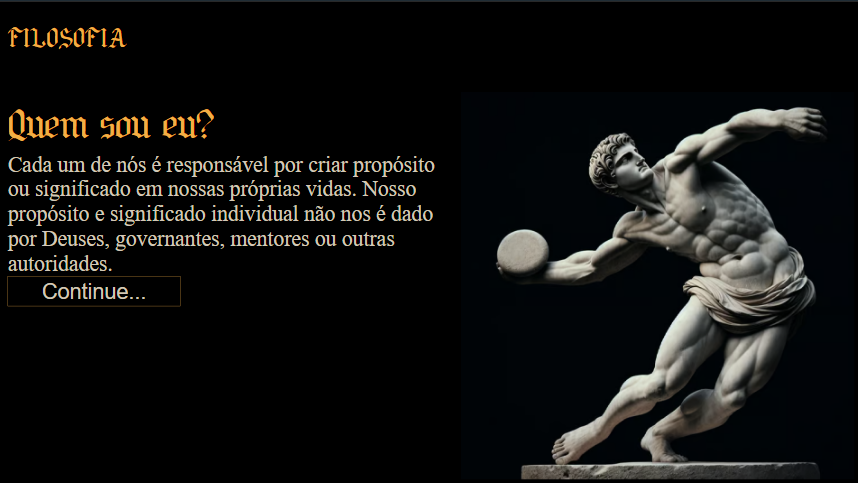
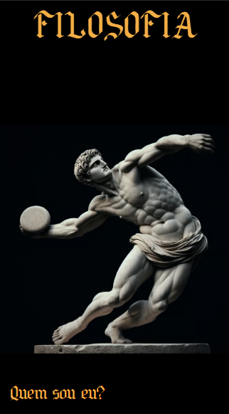

# Filosofia

## Tela 1920x1080:

---
## Tela iPhone SE:

---

## Sobre
Site de divulgação da materia de filosofia, que serve para almentar o interece das pessoas sobre esse estudo.
Esse projeto foi criado durante o curso de desenvolvimento de sistema
do [SENAI Jandira](https://sp.senai.br/unidade/jandira/)

## Tecnologias utilizadas
- JS
- HTML
- CSS
- Markdon
- Git

## Autor
- [Mohammad Salim](https://www.linkedin.com/in/mohammad-salim-197481320/?originalSubdomain=br)

- [Vitor Paes Rodrigues](https://github.com/VitorPaes-coder)